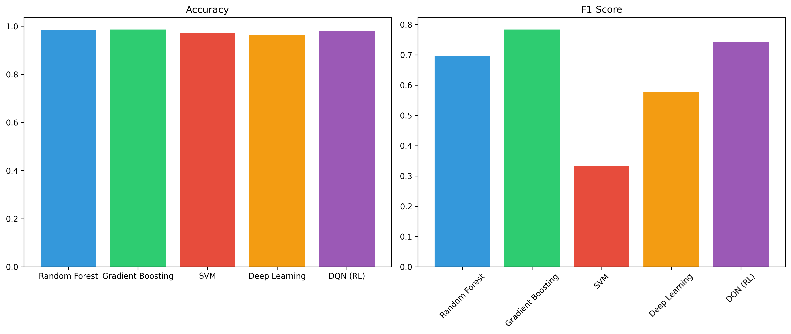
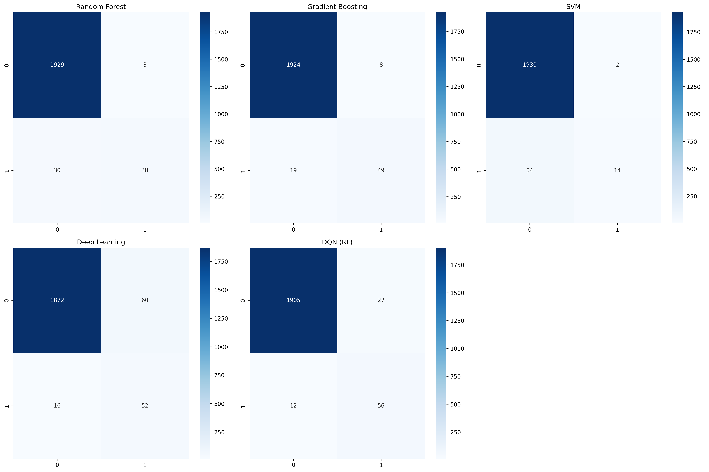
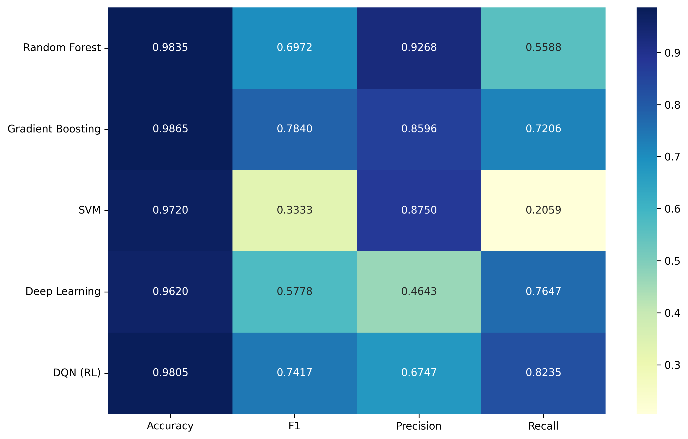
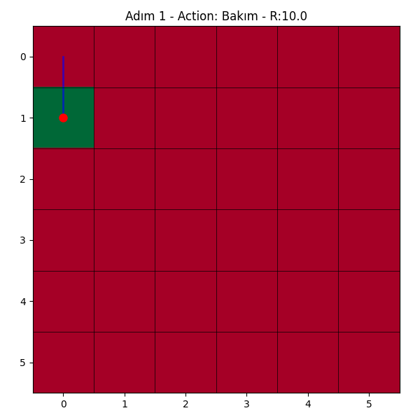

Predictive Maintenance using ML, DL, and RL
Bu proje, endüstriyel makinelerin arıza durumlarını önceden tahmin etmek ve bakım süreçlerini optimize etmek için Makine Öğrenmesi (ML), Derin Öğrenme (DL) ve Takviyeli Öğrenme (RL) tekniklerini bir arada sunar. Projede AI4I 2020 Predictive Maintenance Dataset kullanılmıştır.

📊 Proje Genel Bakış
Proje kapsamında aşağıdaki yaklaşımlar uygulanmıştır:

Geleneksel ML Modelleri: Random Forest, Gradient Boosting ve SVM kullanılarak arıza sınıflandırması yapılmıştır.

Derin Öğrenme (DL): Çok katmanlı bir yapay sinir ağı mimarisi (Dense layers) oluşturulmuştur.

Takviyeli Öğrenme (RL): Bir Deep Q-Network (DQN) ajanı, makine durumuna göre bakım kararları (bakım yap/yapma) verecek şekilde eğitilmiştir.

🖼️ Analiz ve Görselleştirmeler
1. Model Performans Karşılaştırması
Farklı modellerin başarı oranları (Accuracy ve F1-Score) aşağıdaki grafikte karşılaştırılmıştır. Bu grafik, modellerin genel tahmin yeteneğini özetler.

Analiz: Gradient Boosting, hem doğruluk hem de F1 skoru açısından en dengeli performansı sergileyerek en iyi sonuç veren model olmuştur.

2. Hata Matrisleri (Confusion Matrices)
Modellerin hangi durumlarda yanıldığını (yanlış pozitif ve yanlış negatifler) anlamak için konfüzyon matrisleri kullanılmıştır.

Analiz: Matrisler incelendiğinde, modellerin özellikle nadir görülen arıza sınıflarını (Minority Class) yakalama kapasitesi net bir şekilde görülmektedir.

3. Detaylı Metrik Heatmap
Precision, Recall ve F1-Score gibi kritik metriklerin model bazlı dağılımı ısı haritası üzerinden analiz edilmiştir.

4. DQN Ajanı Karar Mekanizması (Simülasyon)
Aşağıdaki animasyon, eğitilen DQN ajanının bir grid ortamında makine durumlarını gözlemleyerek nasıl "Bakım" kararı aldığını temsil eder.

Süreç: Ajan, sensör verilerini (sıcaklık, tork vb.) analiz ederek arıza riskini minimize edecek ve operasyonel karı maksimize edecek stratejiyi öğrenmiştir.

🛠️ Kurulum ve Kullanım
Gereksinimler
Python 3.x

TensorFlow / Keras

Gymnasium

Scikit-learn

Pandas, Numpy, Matplotlib, Seaborn

Çalıştırma
Model Eğitimi: model_training.py dosyasını çalıştırarak modelleri eğitebilirsiniz.

Görselleştirme: Çıktıları ve grafikleri üretmek için visualize.py dosyasını kullanabilirsiniz.
